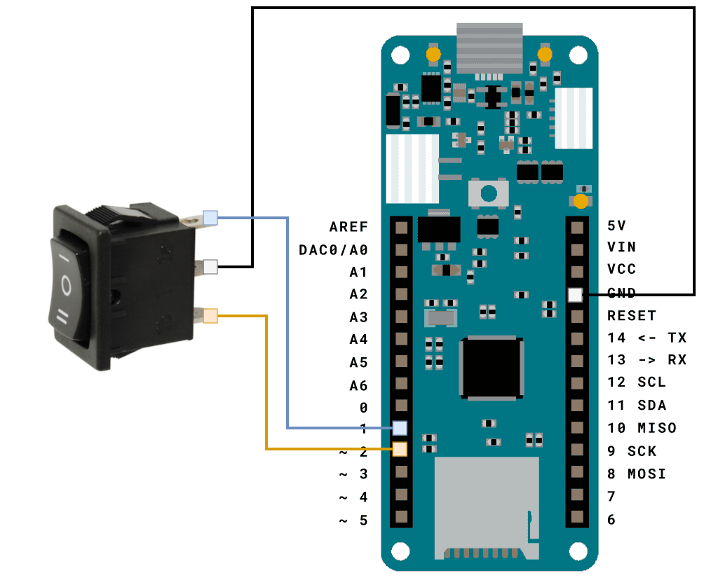
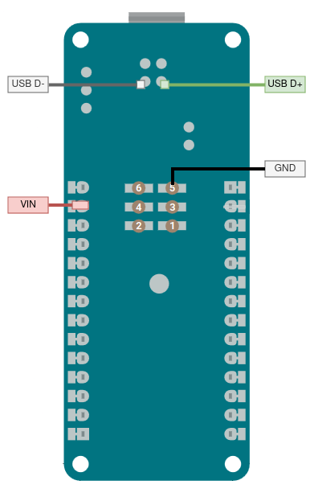

# BeeZero

BeeZero is an Arduino-based keystroke injection USB stick.
It's inspired by the [Hak5 USB Rubber Ducky],
and meant as a tool for educational and training purposes.

## BeeScript

The BeeZero runs a simple custom scripting language called BeeScript.
For the scripting documentation, see [BeeScript.md](BeeScript.md).

## Hardware and Wiring

The BeeZero project is designed for the [Arduino MKR Zero],
but can run on any Arduino that supports the [Keyboard library].
The MKR Zero is chosen mostly for its built-in SD card slot and small form factor,
requiring very minimal work to set everything up.

The default setup requires the following components:

- [Arduino MKR Zero]
- A single pole double throw on-off-on (SPDT) switch

An SPDT switch is a switch that can switch between three states.
This is used to select one of two payloads,
or to disable the payload for development purposes.

To connect the switch to your board, connect the center pole to ground,
and the other poles to pins 1 and 2.
When one of those pins is low, the board will run the respective payload.

Connecting the Arduino to a computer can be done by using the USB port,
or by soldering a USB connector directly to it.
The MKR Zero has some additional pads on the back which can be used for this:

Note that the USB data pads are not documented in the pinout diagrams,
but these can be found in the wiring schematics.

## Payloads

The BeeZero expects an SD card with two files: `one.txt` and `two.txt`.
These files are run as BeeScript when their respective pin is pulled low by the switch.
To disable the payloads, set the switch to the off state to ensure neither pin is connected to ground.

**Note:** the BeeZero only checks the pin states on boot,
so the switch should be set to the desired position _before_ plugging in the device.

## Troubleshooting

TODO: blinking codes

[Hak5 USB Rubber Ducky]: https://docs.hak5.org/hak5-usb-rubber-ducky

[Arduino MKR Zero]: https://docs.arduino.cc/hardware/mkr-zero

[Keyboard library]: https://www.arduino.cc/reference/en/language/functions/usb/keyboard
